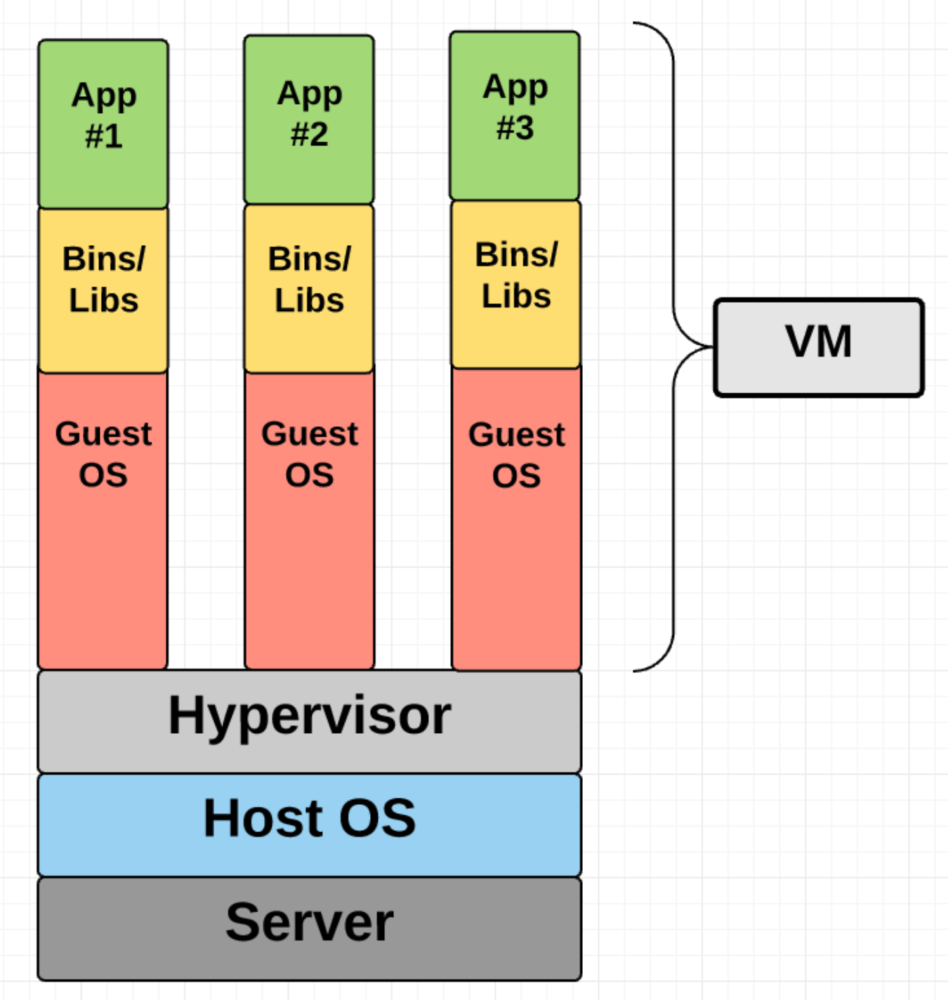
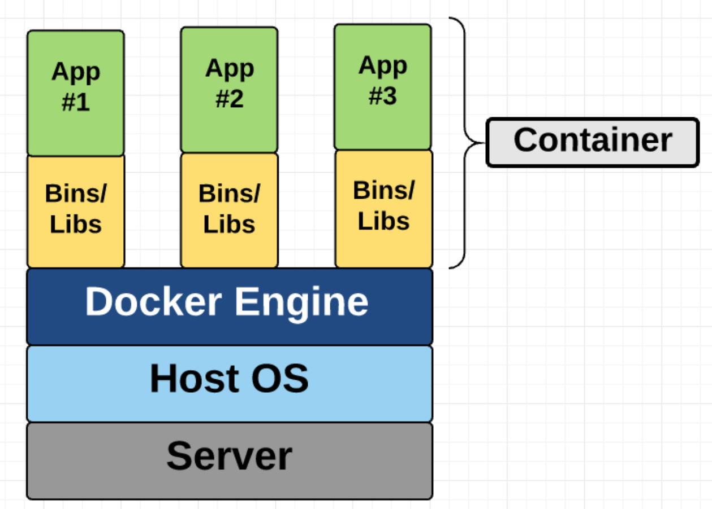
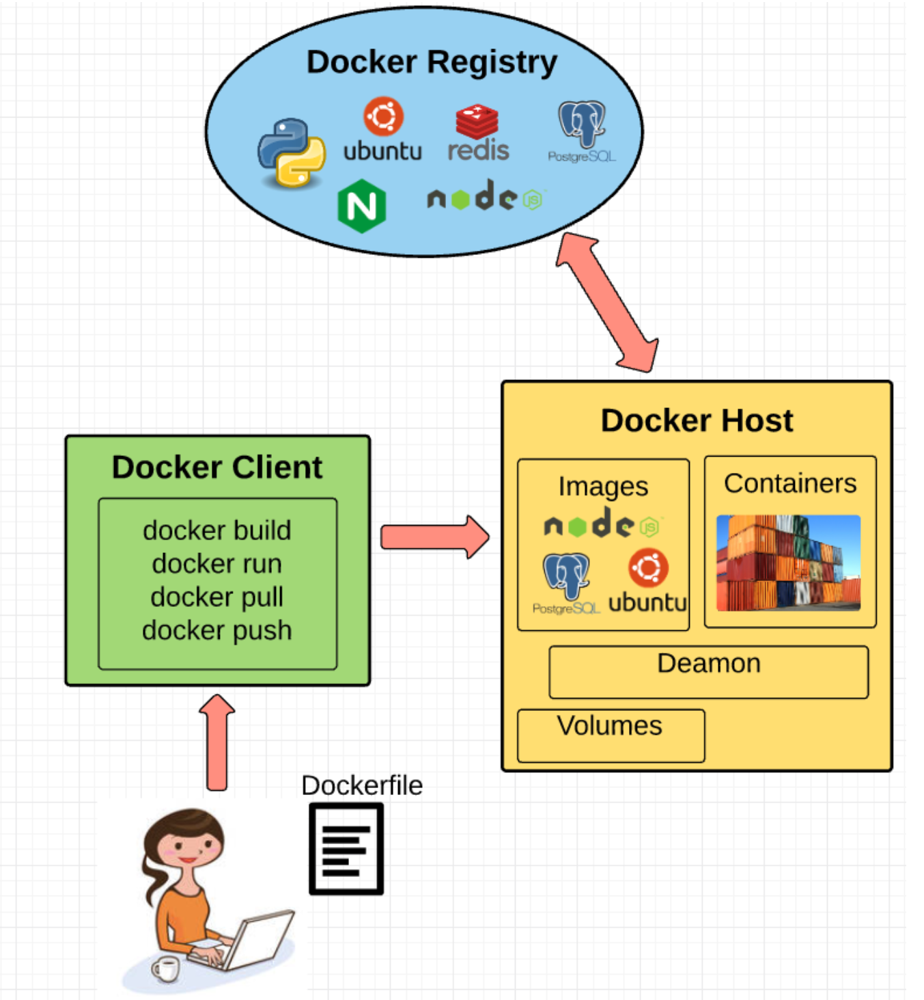

## docker basic


##### VM vs Docker container

- The one big difference between containers and VMs is that containers *share* the host system’s kernel with other containers







## Fundamental Docker Concepts



## docker engine

Docker engine is the layer on which Docker runs. It’s a lightweight runtime and tooling that manages containers, images, builds, and more. It runs natively on Linux systems and is made up of:

1. A Docker Daemon that runs in the host computer
2. A Docker Client that then communicates with the Docker Daemon to execute commands.
3. A REST API for interacting with the Docker Daemon remotely.

## docker client

The Docker Client is what you, as the end-user of Docker, communicate with. Think of it as the UI for Docker. For example, when you do…

```docker
docker build cgh2/python3
```

you are communicating to the Docker Client, which then communicates your instructions to the Docker Daemon.

## docker daemon

The Docker daemon is what actually executes commands sent to the Docker Client — like building, running, and distributing your containers. The Docker Daemon runs on the host machine, but as a user, you never communicate directly with the Daemon. The Docker Client can run on the host machine as well, but it’s not required to. It can run on a different machine and communicate with the Docker Daemon that’s running on the host machine.

## Dockerfile

A Dockerfile is where you write the instructions to build a Docker image. These instructions can be:

- **RUN apt-get y install some-package**: to install a software package
- **EXPOSE 8000:** to expose a port
- **ENV ANT_HOME /usr/local/apache-ant** to pass an environment variable

and so forth. Once you’ve got your Dockerfile set up, you can use the **docker build** command to build an image from it. Here’s an example of a Dockerfile:

```

FROM jare/alpine-vim:latest

# User config
ENV UID="1000" \
    UNAME="developer" \
    GID="1000" \
    GNAME="developer" \
    SHELL="/bin/bash" \
    UHOME=/home/developer

# Used to configure YouCompleteMe
ENV GOROOT="/usr/lib/go"
ENV GOBIN="$GOROOT/bin"
ENV GOPATH="$UHOME/workspace"
ENV PATH="$PATH:$GOBIN:$GOPATH/bin"

# User
RUN apk --no-cache add sudo \
# Create HOME dir
    && mkdir -p "${UHOME}" \
    && chown "${UID}":"${GID}" "${UHOME}" \
# Create user
    && echo "${UNAME}:x:${UID}:${GID}:${UNAME},,,:${UHOME}:${SHELL}" \
    >> /etc/passwd \
    && echo "${UNAME}::17032:0:99999:7:::" \
    >> /etc/shadow \
# No password sudo
    && echo "${UNAME} ALL=(ALL) NOPASSWD: ALL" \
    > "/etc/sudoers.d/${UNAME}" \
    && chmod 0440 "/etc/sudoers.d/${UNAME}" \
# Create group
    && echo "${GNAME}:x:${GID}:${UNAME}" \
    >> /etc/group

# Install Pathogen
RUN apk --no-cache add curl \
    && mkdir -p \
    $UHOME/bundle \
    $UHOME/.vim/autoload \
    $UHOME/.vim_runtime/temp_dirs \
    && curl -LSso \
    $UHOME/.vim/autoload/pathogen.vim \
    https://tpo.pe/pathogen.vim \
    && echo "execute pathogen#infect('$UHOME/bundle/{}')" \
    > $UHOME/.vimrc \
    && echo "syntax on " \
    >> $UHOME/.vimrc \
    && echo "filetype plugin indent on " \
    >> $UHOME/.vimrc \
# Cleanup
    && apk del curl

# Vim wrapper
COPY run /usr/local/bin/
#custom .vimrc stub
RUN mkdir -p /ext  && echo " " > /ext/.vimrc

COPY .vimrc $UHOME/my.vimrc

# Vim plugins deps
RUN apk --update add \
    bash \
    ctags \
    curl \
    git \
    ncurses-terminfo \
    python \
# YouCompleteMe
    && apk add --virtual build-deps \
    build-base \
    cmake \
    go \
    llvm \
    perl \
    python-dev \
    && git clone --depth 1  https://github.com/Valloric/YouCompleteMe \
    $UHOME/bundle/YouCompleteMe/ \
    && cd $UHOME/bundle/YouCompleteMe \
    && git submodule update --init --recursive \
    && $UHOME/bundle/YouCompleteMe/install.py --gocode-completer \
# Install and compile procvim.vim                        
    && git clone --depth 1 https://github.com/Shougo/vimproc.vim \
    $UHOME/bundle/vimproc.vim \
    && cd $UHOME/bundle/vimproc.vim \
    && make \
    && chown $UID:$GID -R $UHOME \
# Cleanup
    && apk del build-deps \
    && apk add \
    libxt \
    libx11 \
    libstdc++ \
    && rm -rf \
    $UHOME/bundle/YouCompleteMe/third_party/ycmd/clang_includes \
    $UHOME/bundle/YouCompleteMe/third_party/ycmd/cpp \
    /usr/lib/go \
    /var/cache/* \
    /var/log/* \
    /var/tmp/* \
    && mkdir /var/cache/apk

USER $UNAME

# Plugins
RUN cd $UHOME/bundle/ \
    && git clone --depth 1 https://github.com/pangloss/vim-javascript \
    && git clone --depth 1 https://github.com/scrooloose/nerdcommenter \
    && git clone --depth 1 https://github.com/godlygeek/tabular \
    && git clone --depth 1 https://github.com/Raimondi/delimitMate \
    && git clone --depth 1 https://github.com/nathanaelkane/vim-indent-guides \
    && git clone --depth 1 https://github.com/groenewege/vim-less \
    && git clone --depth 1 https://github.com/othree/html5.vim \
    && git clone --depth 1 https://github.com/elzr/vim-json \
    && git clone --depth 1 https://github.com/bling/vim-airline \
    && git clone --depth 1 https://github.com/easymotion/vim-easymotion \
    && git clone --depth 1 https://github.com/mbbill/undotree \
    && git clone --depth 1 https://github.com/majutsushi/tagbar \
    && git clone --depth 1 https://github.com/vim-scripts/EasyGrep \
    && git clone --depth 1 https://github.com/jlanzarotta/bufexplorer \
    && git clone --depth 1 https://github.com/kien/ctrlp.vim \
    && git clone --depth 1 https://github.com/scrooloose/nerdtree \
    && git clone --depth 1 https://github.com/jistr/vim-nerdtree-tabs \
    && git clone --depth 1 https://github.com/scrooloose/syntastic \
    && git clone --depth 1 https://github.com/tomtom/tlib_vim \
    && git clone --depth 1 https://github.com/marcweber/vim-addon-mw-utils \
    && git clone --depth 1 https://github.com/vim-scripts/taglist.vim \
    && git clone --depth 1 https://github.com/terryma/vim-expand-region \
    && git clone --depth 1 https://github.com/tpope/vim-fugitive \
    && git clone --depth 1 https://github.com/airblade/vim-gitgutter \
    && git clone --depth 1 https://github.com/fatih/vim-go \
    && git clone --depth 1 https://github.com/plasticboy/vim-markdown \
    && git clone --depth 1 https://github.com/michaeljsmith/vim-indent-object \
    && git clone --depth 1 https://github.com/terryma/vim-multiple-cursors \
    && git clone --depth 1 https://github.com/tpope/vim-repeat \
    && git clone --depth 1 https://github.com/tpope/vim-surround \
    && git clone --depth 1 https://github.com/vim-scripts/mru.vim \
    && git clone --depth 1 https://github.com/vim-scripts/YankRing.vim \
    && git clone --depth 1 https://github.com/tpope/vim-haml \
    && git clone --depth 1 https://github.com/SirVer/ultisnips \
    && git clone --depth 1 https://github.com/honza/vim-snippets \
    && git clone --depth 1 https://github.com/derekwyatt/vim-scala \
    && git clone --depth 1 https://github.com/christoomey/vim-tmux-navigator \
    && git clone --depth 1 https://github.com/ekalinin/Dockerfile.vim \
# Theme
    && git clone --depth 1 \
    https://github.com/altercation/vim-colors-solarized
    
# Build default .vimrc
RUN  mv -f $UHOME/.vimrc $UHOME/.vimrc~ \
     && curl -s \
     https://raw.githubusercontent.com/amix/vimrc/master/vimrcs/basic.vim \
     >> $UHOME/.vimrc~ \
     && curl -s \
     https://raw.githubusercontent.com/amix/vimrc/master/vimrcs/extended.vim \
     >> $UHOME/.vimrc~ \
     && cat  $UHOME/my.vimrc \
     >> $UHOME/.vimrc~ \
     && rm $UHOME/my.vimrc \
     && sed -i '/colorscheme peaksea/d' $UHOME/.vimrc~

# Pathogen help tags generation
RUN vim -E -c 'execute pathogen#helptags()' -c q ; return 0

ENV TERM=xterm-256color

# List of Vim plugins to disable
ENV DISABLE=""

ENTRYPOINT ["sh", "/usr/local/bin/run"]
```

## docker image

Images are read-only templates that you build from a set of instructions written in your Dockerfile. Images define both what you want your packaged application and its dependencies to look like *and* what processes to run when it’s launched.

The Docker image is built using a Dockerfile. Each instruction in the Dockerfile adds a new “layer” to the image, with layers representing a portion of the images file system that either adds to or replaces the layer below it. Layers are key to Docker’s lightweight yet powerful structure. Docker uses a Union File System to achieve this:

## Union file system

Docker uses Union File Systems to build up an image. You can think of a Union File System as a stackable file system, meaning files and directories of separate file systems (known as branches) can be transparently overlaid to form a single file system.

The contents of directories which have the same path within the overlaid branches are seen as a single merged directory, which avoids the need to create separate copies of each layer. Instead, they can all be given pointers to the same resource; when certain layers need to be modified, it’ll create a copy and modify a local copy, leaving the original unchanged. That’s how file systems can *appear* writable without actually allowing writes. (In other words, a “copy-on-write” system.)

Layered systems offer two main benefits:

1. **Duplication-free:** layers help avoid duplicating a complete set of files every time you use an image to create and run a new container, making instantiation of docker containers very fast and cheap.
2. Layer segregation:** Making a change is much faster — when you change an image, Docker only propagates the updates to the layer that was changed

## volumes

Volumes are the “data” part of a container, initialized when a container is created. Volumes allow you to persist and share a container’s data. Data volumes are separate from the default Union File System and exist as normal directories and files on the host filesystem. So, even if you destroy, update, or rebuild your container, the data volumes will remain untouched. When you want to update a volume, you make changes to it directly. (As an added bonus, data volumes can be shared and reused among multiple containers, which is pretty neat.)

## docker containers

A Docker container, as discussed above, wraps an application’s software into an invisible box with everything the application needs to run. That includes the operating system, application code, runtime, system tools, system libraries, and etc. Docker containers are built off Docker images. Since images are read-only, Docker adds a read-write file system over the read-only file system of the image to create a container.


Moreover, then creating the container, Docker creates a network interface so that the container can talk to the local host, attaches an available IP address to the container, and executes the process that you specified to run your application when defining the image.

Once you’ve successfully created a container, you can then run it in any environment without having to make changes.


